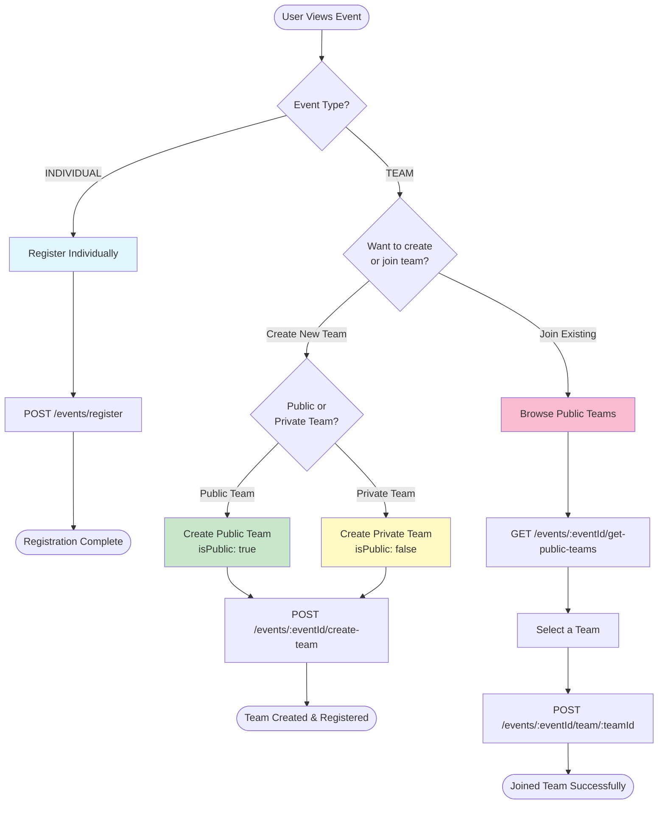
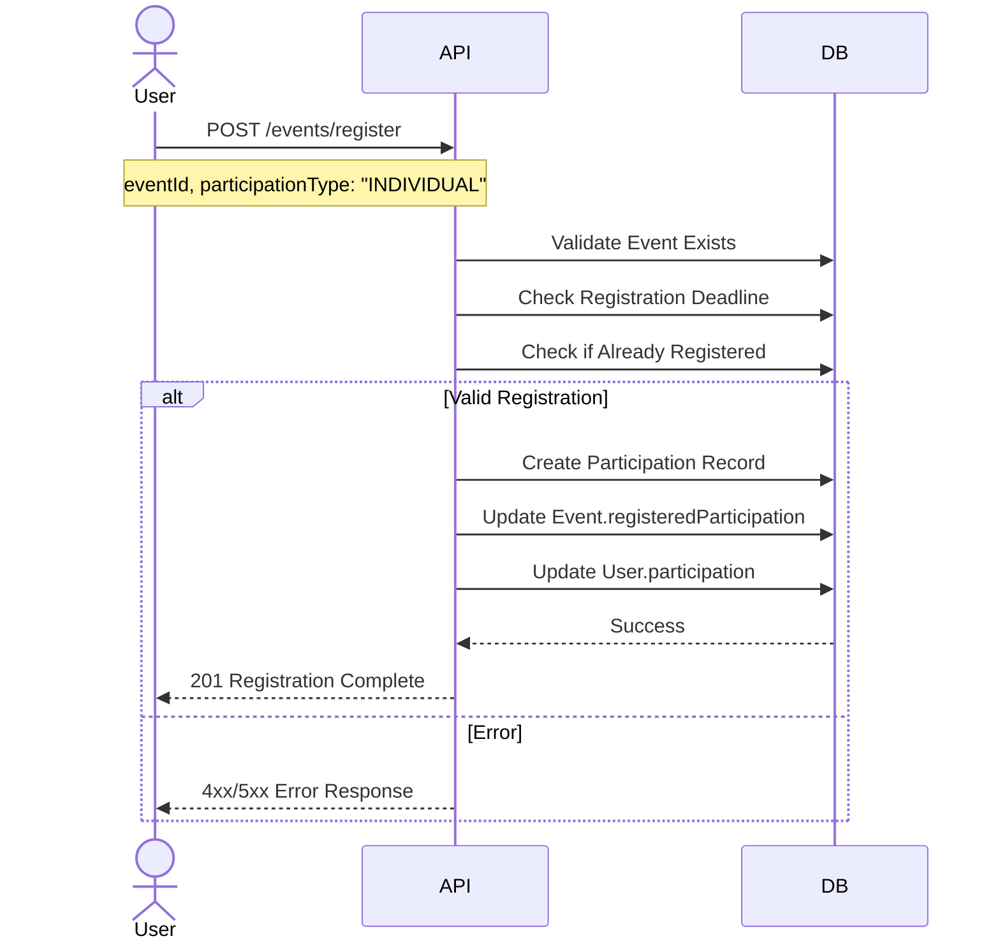
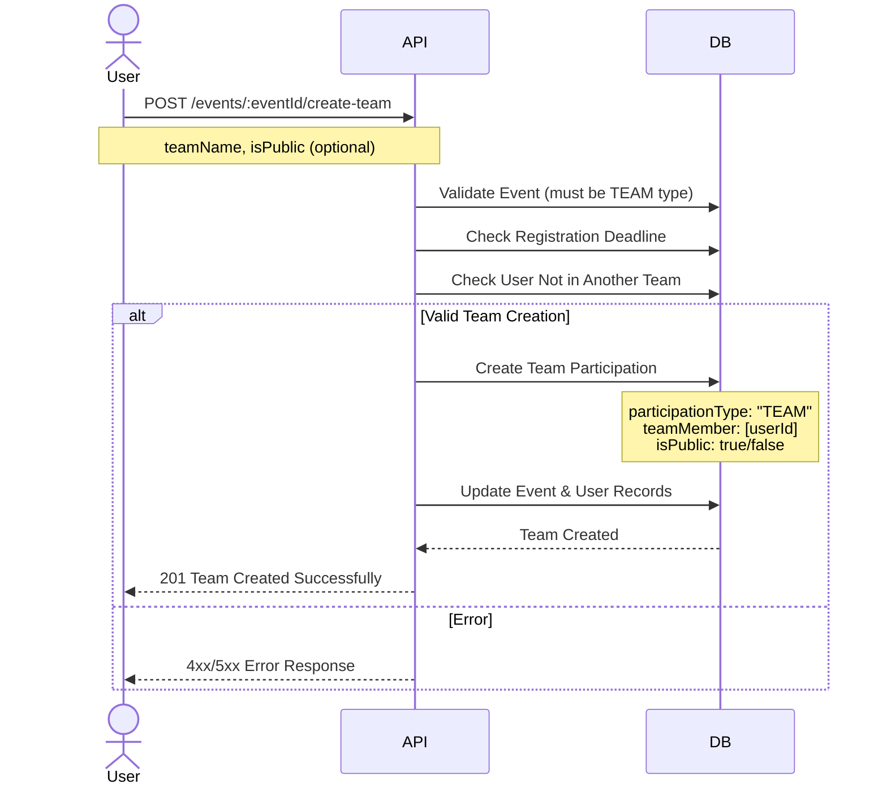
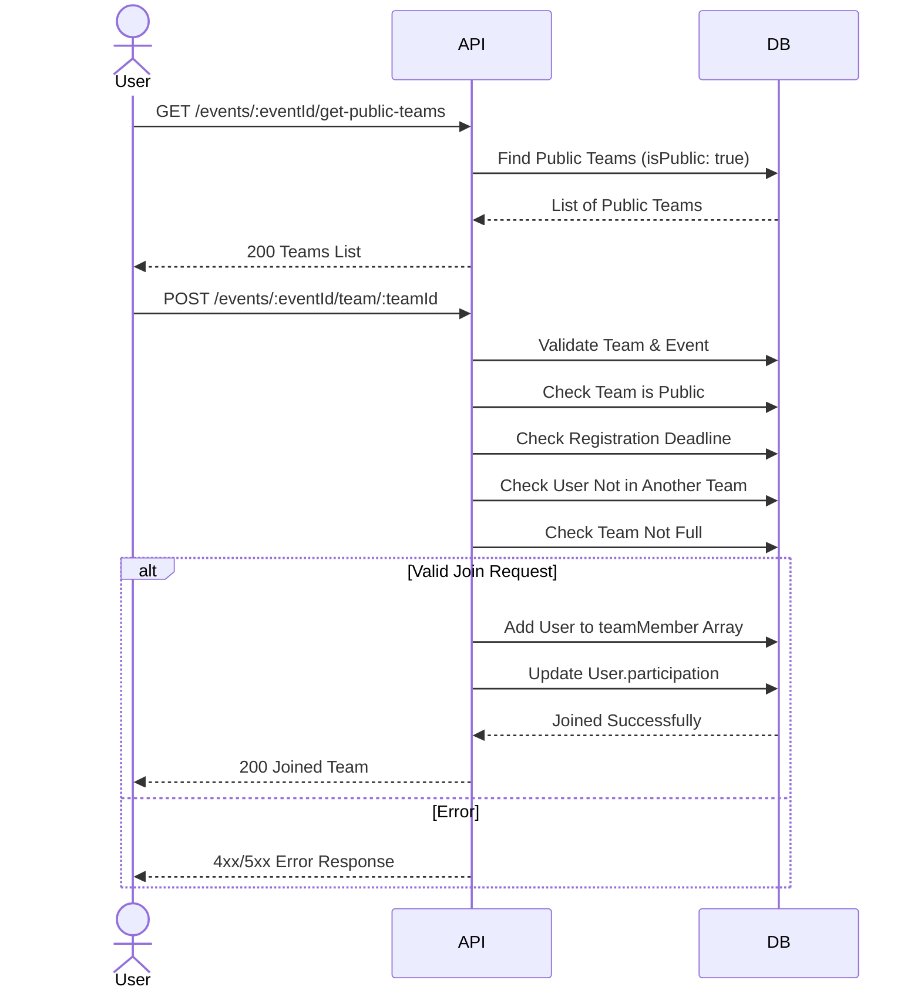

# Effulgence26 Backend API Documentation

## Table of Contents
- [Overview](#overview)
- [Setup Instructions](#setup-instructions)
- [Authentication](#authentication)
- [User Management APIs](#user-management-apis)
- [Event Management APIs](#event-management-apis)
- [Domain Management APIs](#domain-management-apis)
- [Data Models](#data-models)
- [Error Handling](#error-handling)

---

## Overview

The Effulgence26 Backend is a RESTful API service built with Node.js and Express.js for managing an event management platform. It includes features for user authentication, event management, and participant registration.

### Tech Stack
- **Runtime**: Node.js
- **Framework**: Express.js v5.2.1
- **Database**: MongoDB (via Mongoose v9.0.2)
- **Authentication**: JWT (JSON Web Tokens)
- **Caching**: Redis v5.10.0
- **Validation**: Zod v4.2.1
- **Security**: Helmet, CORS, Express Mongo Sanitize

### Important Notes
- **Domain Endpoints**: The `/domains` and `/domains/:id` endpoints are documented but not yet implemented in the backend. The Flutter app expects these endpoints but they will return 404 until implemented.
- **Join Team Endpoint**: Added in this documentation update - allows users to join existing teams for team events.

### Base URL
```
Development: http://localhost:5000
Production: https://api.effulgence26.live/
```

---

## Setup Instructions

### 1. Environment Variables
Create a `.env` file in the root directory:

```env
MONGO_URI=mongodb://localhost:27017/effulgence
JWT_SECRET=your_super_secret_key_change_this_in_production
PORT=5000
NODE_ENV=development
CORS_ORIGINS=http://localhost:5173,http://localhost:3000,https://www.effulgence26.live,https://effulgence26.live,http://localhost:5174
```

### 2. Installation
```bash
npm install
```

### 3. Run the Server
```bash
# Development mode
npm run dev

# Production mode
npm start
```

### 4. Create Super Admin (Optional)
```bash
node src/scripts/seedSuperAdmin.js
```

---

## Authentication

### Cookie-Based Authentication
The API uses HTTP-only cookies for session management. After successful login/signup, an `authToken` cookie is set with the following properties:
- **httpOnly**: true
- **secure**: true (in production)
- **sameSite**: 'lax'
- **maxAge**: 7 days

### JWT Token Structure
```javascript
{
  userId: string,
  role: string,
  sessionId: string
}
```

---

## User Management APIs

### 1. User Signup

**Endpoint**: `POST /user/signup`

**Rate Limit**: 100 requests per hour per IP

**Request Body**:
```json
{
  "name": "John Doe",
  "email": "john@example.com",
  "password": "securepassword123",
  "mobile": 9876543210,
  "rollno": 12345,
  "imageUrl": "https://example.com/image.jpg" // optional
}
```

**Validation Rules**:
- `name`: minimum 3 characters
- `email`: valid email format
- `password`: minimum 8 characters
- `mobile`: number
- `rollno`: number
- `imageUrl`: optional string

**Notes**:
- Users with KNIT email addresses (@knit.ac.in) are automatically approved and marked as internal users
- Other users have pending approval status and need admin approval to access the system

**Success Response** (200):
```json
{
  "message": "OTP sent successfully. Check console.",
  "step": "verify"
}
```

**Error Responses**:
- `400`: Invalid input
- `409`: Email or OTP already sent/exists
- `500`: Internal server error

---

### 2. Verify OTP (Complete Signup)

**Endpoint**: `POST /user/verify-otp`

**Request Body**:
```json
{
  "email": "john@example.com",
  "otp": 123456
}
```

**Success Response** (201):
```json
{
  "message": "Registration successful",
  "user": {
    "id": "507f1f77bcf86cd799439011",
    "name": "John Doe",
    "email": "john@example.com",
    "mobile": 9876543210,
    "role": "USER"
  }
}
```
*Sets `authToken` cookie.*

**Error Responses**:
- `400`: Invalid OTP or expired
- `409`: Email already exists
- `500`: Server error

---

### 3. Resend OTP

**Endpoint**: `POST /user/resend-otp`

**Request Body**:
```json
{
  "email": "john@example.com",
  // Include full signup data if retrying from scratch, otherwise just email is typically needed to find existing OTP record, but validation requires full schema.
  "name": "John Doe",
  "password": "...", 
  "mobile": 9876543210,
  "rollno": 12345
}
```

**Success Response** (200):
```json
{
  "message": "New OTP sent successfully. Check console.",
  "step": "verify"
}
```

**Error Responses**:
- `400`: Max resends reached
- `409`: User already exists
- `500`: Server error

---

### 4. User Login

**Endpoint**: `POST /user/login`

**Rate Limit**: 10 requests per 15 minutes per email/IP

**Request Body**:
```json
{
  "email": "john@example.com",
  "password": "securepassword123"
}
```

**Success Response** (200):
```json
{
  "message": "success",
  "user": {
    "id": "507f1f77bcf86cd799439011",
    "name": "John Doe",
    "email": "john@example.com",
    "role": "USER"
  }
}
```

**Error Responses**:
- `400`: Invalid input
- `401`: Email or password is incorrect
- `403`: User registration is pending/rejected or user is blocked
- `500`: Internal server error

---

### 5. User Logout

**Endpoint**: `POST /user/logout`

**Authentication**: Required

**Success Response** (200):
```json
{
  "message": "Logout successful"
}
```

**Error Responses**:
- `401`: Unauthorized
- `404`: User not found
- `500`: Internal server error

---

### 6. Get User Profile

**Endpoint**: `GET /user/profile`

**Authentication**: Required

**Success Response** (200):
```json
{
  "user": {
    "_id": "507f1f77bcf86cd799439011",
    "name": "John Doe",
    "imageUrl": "https://example.com/image.jpg",
    "email": "john@example.com",
    "mobile": 9876543210,
    "rollno": 12345,
    "isEmailVerified": false,
    "role": "USER",
    "managedDomains": [],
    "isInternalUser": false,
    "approvalStatus": "PENDING",
    "paymentReceiptUrl": null,
    "approvalAudit": {},
    "allowMultipleSessions": false,
    "qrcode": "",
    "participation": [],
    "isBlocked": false
  }
}
```

**Error Responses**:
- `401`: Unauthorized
- `404`: User not found
- `500`: Failed to fetch user details

---

### 7. Update User Profile

**Endpoint**: `POST /user/profile/edit`

**Authentication**: Required

**Request Body**:
```json
{
  "name": "John Updated",
  "imageUrl": "https://example.com/new-image.jpg",
  "mobile": 9876543210
}
```

**Validation Rules**:
- All fields are optional
- `name`: minimum 3 characters (if provided)
- `mobile`: integer (if provided)

**Success Response** (200):
```json
{
  "message": "Profile updated successfully",
  "user": {
    "_id": "507f1f77bcf86cd799439011",
    "name": "John Updated",
    "email": "john@example.com",
    "mobile": 9876543210,
    ...
  }
}
```

**Error Responses**:
- `400`: Invalid input
- `401`: Unauthorized
- `404`: User not found
- `500`: Failed to update profile

---

### 8. Get All Users (Super Admin Only)

**Endpoint**: `GET /user/users`

**Authentication**: Required (SUPER_ADMIN role)

**Success Response** (200):
```json
{
  "users": [
    {
      "_id": "507f1f77bcf86cd799439011",
      "email": "user1@example.com",
      "role": "USER"
    },
    {
      "_id": "507f1f77bcf86cd799439012",
      "email": "user2@example.com",
      "role": "ADMIN"
    }
  ]
}
```

**Error Responses**:
- `401`: Unauthorized
- `403`: Forbidden (insufficient permissions)
- `404`: No users found
- `500`: Failed to fetch users

---

### 9. Get External Users (Super Admin Only)

**Endpoint**: `GET /user/users/external`

**Authentication**: Required (SUPER_ADMIN role)

**Description**: Retrieves all users who are not internal users (isInternalUser: false)

**Success Response** (200):
```json
{
  "users": [
    {
      "_id": "507f1f77bcf86cd799439011",
      "email": "external@example.com",
      "role": "USER"
    },
    {
      "_id": "507f1f77bcf86cd799439012",
      "email": "another@example.com",
      "role": "USER"
    }
  ]
}
```

**Error Responses**:
- `401`: Unauthorized
- `403`: Forbidden
- `404`: No users found
- `500`: Failed to fetch users

---

### 10. Update User Role (Super Admin Only)

**Endpoint**: `PATCH /user/update-role`

**Authentication**: Required (SUPER_ADMIN role)

**Request Body**:
```json
{
  "targetUserId": "507f1f77bcf86cd799439011",
  "newRole": "ADMIN",
  "remarks": "Promoted to admin role"
}
```

**Available Roles**:
- `USER`
- `ADMIN`
- `SUPER_ADMIN`

**Success Response** (200):
```json
{
  "message": "Role updated successfully",
  "user": {
    "id": "507f1f77bcf86cd799439011",
    "name": "John Doe",
    "email": "john@example.com",
    "oldRole": "USER",
    "newRole": "ADMIN"
  }
}
```

**Error Responses**:
- `400`: Invalid input or user already has the role
- `401`: Unauthorized
- `403`: Forbidden
- `404`: Target user not found
- `500`: Failed to update role

---

### 11. Approve/Reject User Status (Admin/Super Admin)

**Endpoint**: `PATCH /user/approveStatus`

**Authentication**: Required (ADMIN or SUPER_ADMIN role)

**Request Body**:
```json
{
  "userId": "507f1f77bcf86cd799439011",
  "status": "APPROVED",
  "remarks": "User verified and approved"
}
```

**Available Status Values**:
- `APPROVED`
- `REJECTED`

**Success Response** (200):
```json
{
  "message": "User is APPROVED",
  "data": {
    "approvalStatus": "APPROVED"
  }
}
```

**Error Responses**:
- `400`: Invalid input or user already has the status
- `401`: Unauthorized
- `403`: Forbidden
- `404`: User not found
- `500`: Approval Status Update Failed

---

### 12. Get Registered Events for User

**Endpoint**: `GET /user/:userId/registered-events`

**Authentication**: Required

**URL Parameters**:
- `userId`: User ID (MongoDB ObjectId)

**Authorization**: Only the user themselves or a SUPER_ADMIN can access this endpoint

**Success Response** (200):
```json
{
  "data": [
    {
      "_id": "507f1f77bcf86cd799439012",
      "event": {
        "_id": "507f1f77bcf86cd799439011",
        "title": "Code Sprint 2026",
        "coverImage": "https://example.com/cover.jpg",
        "eventType": "INDIVIDUAL",
        "eventVenue": "Computer Lab 101"
      },
      "participationType": "INDIVIDUAL",
      "registeredAt": "2026-01-05T10:00:00.000Z",
      "isPresent": false,
      "rank": null,
      "score": 0,
      "isQualified": false
    }
  ]
}
```

**Empty Response** (200):
```json
{
  "message": "No Events Found",
  "data": []
}
```

**Error Responses**:
- `400`: Invalid user ID
- `401`: Unauthorized
- `403`: Forbidden (accessing another user's events)
- `404`: User not found
- `500`: Internal server error

---

## Event Management APIs

### 1. Get All Events

**Endpoint**: `GET /events/`

**Rate Limit**: 50 requests per hour per IP

**Authentication**: Not required

**Success Response** (200):
```json
{
  "data": [
    {
      "_id": "507f1f77bcf86cd799439011",
      "title": "Code Sprint 2026",
      "coverImage": "https://example.com/cover.jpg",
      "description": "A competitive coding event",
      "rules": "Follow standard coding practices",
      "domain": "programming",
      "eventRound": 1,
      "eventType": "INDIVIDUAL",
      "teamConfig": {
        "minSize": 1,
        "maxSize": 1
      },
      "eventVenue": "Computer Lab 101",
      "eventTime": "2026-02-15T10:00:00.000Z",
      "registrationDeadline": "2026-02-10T23:59:59.000Z",
      "status": "UPCOMING",
      "isDeleted": false,
      "createdAt": "2026-01-01T00:00:00.000Z",
      "updatedAt": "2026-01-01T00:00:00.000Z"
    }
  ]
}
```

**Error Responses**:
- `404`: No events found
- `404`: No events found
- `500`: Error while fetching events

---

### 2. Get Event Details

**Endpoint**: `GET /events/:eventId`

**Authentication**: Not required (public)

**URL Parameters**:
- `eventId`: Event ID (MongoDB ObjectId)

**Success Response** (200):
```json
{
  "message": "Below are event details",
  "data": {
    "_id": "507f1f77bcf86cd799439011",
    "title": "Code Sprint 2026",
    "coverImage": "https://example.com/cover.jpg",
    "description": "A competitive coding event",
    "rules": "...",
    "domain": "programming",
    "eventRound": 1,
    "eventType": "INDIVIDUAL",
    "teamConfig": { ... },
    "eventVenue": "Lab 1",
    "eventTime": "2026-02-15T10:00:00.000Z",
    "endTime": "...",
    "registrationDeadline": "...",
    "status": "UPCOMING"
  }
}
```

**Error Responses**:
- `400`: Invalid Event Id
- `404`: Event not found
- `500`: Failed to fetch event details

---

## Event Registration Flow Overview

This section provides a comprehensive overview of how users can register for events in the Effulgence26 platform.

### Event Types

Events in Effulgence26 can be of two types:

1. **INDIVIDUAL Events**: Users register individually
2. **TEAM Events**: Users must be part of a team to participate

### Registration Decision Flow



### Team Registration: Public vs Private Teams

When creating a team for a team event, users can specify whether their team should be **public** or **private**:

#### Public Teams (`isPublic: true`)
- Visible in the public teams list (`GET /events/:eventId/get-public-teams`)
- Other users can browse and join these teams
- Useful for finding teammates or allowing others to join
- Recommended for users who want to grow their team

#### Private Teams (`isPublic: false`, default)
- Not visible in the public teams list
- Other users cannot discover or join these teams directly
- Team creator controls who joins (must share team ID manually)
- Recommended for pre-formed teams or closed groups

> [!NOTE]
> By default, if `isPublic` is not specified when creating a team, it will be set to `false` (private team).

### Registration Flow Details

#### Individual Event Registration Flow



#### Team Creation Flow



#### Join Public Team Flow



### Key Validation Rules

1. **Registration Deadline**: All registration operations check if the event's `registrationDeadline` has passed
2. **No Duplicate Registration**: Users cannot register for the same event twice
3. **Team Event Constraints**: 
   - Users can only be part of one team per event
   - Teams must respect `teamConfig.maxSize` limit
   - Only public teams can be discovered and joined via API
4. **Event Type Matching**: Registration type must match event type (INDIVIDUAL or TEAM)

---

### 3. Create Event (Admin/Super Admin)

**Endpoint**: `POST /events/create`

**Authentication**: Required (ADMIN or SUPER_ADMIN role)

**Request Body**:
```json
{
  "title": "Code Sprint 2026",
  "coverImage": "https://example.com/cover.jpg",
  "description": "A competitive coding event",
  "rules": "Follow standard coding practices",
  "domain": "programming",
  "eventRound": 1,
  "eventType": "INDIVIDUAL",
  "teamConfig": {
    "minSize": 1,
    "maxSize": 1
  },
  "eventVenue": "Computer Lab 101",
  "eventTime": "2026-02-15T10:00:00.000Z",
  "registrationDeadline": "2026-02-10T23:59:59.000Z"
}
```

**Validation Rules**:
- `title`: required string
- `coverImage`: optional URL
- `description`: required string
- `rules`: required string
- `domain`: enum [`programming`, `robotics`, `entrepreneurial`, `miscellaneous`]
- `eventRound`: required number
- `eventType`: enum [`INDIVIDUAL`, `TEAM`]
- `teamConfig`: optional object (required for TEAM events)
  - `minSize`: number (default: 1)
  - `maxSize`: number (default: 1)
- `eventVenue`: required string
- `eventTime`: required date string
- `registrationDeadline`: required date string

**Success Response** (201):
```json
{
  "message": "event created successfully",
  "event": {
    "_id": "507f1f77bcf86cd799439011",
    "title": "Code Sprint 2026",
    ...
  }
}
```

**Error Responses**:
- `400`: Invalid input
- `401`: Unauthorized
- `403`: Forbidden
- `409`: Event already exists with this title
- `500`: Error creating event

---

### 4. Edit Event (Admin/Super Admin)

**Endpoint**: `PATCH /events/:id/edit`

**Authentication**: Required (ADMIN or SUPER_ADMIN role)

**URL Parameters**:
- `id`: Event ID (MongoDB ObjectId)

**Request Body** (all fields optional):
```json
{
  "title": "Updated Code Sprint 2026",
  "coverImage": "https://example.com/new-cover.jpg",
  "description": "An updated description",
  "rules": "Updated rules",
  "domain": "programming",
  "eventRound": 2,
  "eventType": "TEAM",
  "teamConfig": {
    "minSize": 2,
    "maxSize": 4
  },
  "eventVenue": "Computer Lab 201",
  "eventTime": "2026-02-16T10:00:00.000Z",
  "registrationDeadline": "2026-02-11T23:59:59.000Z"
}
```

**Success Response** (200):
```json
{
  "message": "Event updated successfully",
  "event": {
    "_id": "507f1f77bcf86cd799439011",
    "title": "Updated Code Sprint 2026",
    ...
  }
}
```

**Error Responses**:
- `400`: Invalid input or no fields to update or invalid event ID format
- `401`: Unauthorized
- `403`: Forbidden
- `404`: Event not found
- `409`: Event already exists with this title
- `500`: Internal server error

---

### 5. Delete Event (Admin/Super Admin)

**Endpoint**: `PATCH /events/:id/delete`

**Authentication**: Required (ADMIN or SUPER_ADMIN role)

**URL Parameters**:
- `id`: Event ID (MongoDB ObjectId)

**Note**: This is a soft delete operation. The event is marked as deleted but not removed from the database.

**Success Response** (200):
```json
{
  "message": "Event deleted successfully",
  "event": {
    "id": "507f1f77bcf86cd799439011",
    "title": "Code Sprint 2026"
  }
}
```

**Error Responses**:
- `400`: Invalid event ID format
- `401`: Unauthorized
- `403`: Forbidden
- `404`: Event not found or already deleted
- `500`: Internal server error

---

### 6. Restore Event (Admin/Super Admin)

**Endpoint**: `PATCH /events/:id/restore-event`

**Authentication**: Required (ADMIN or SUPER_ADMIN role)

**URL Parameters**:
- `id`: Event ID (MongoDB ObjectId)

**Note**: This restores a previously soft-deleted event.

**Success Response** (200):
```json
{
  "message": "Event restored successfully",
  "event": {
    "id": "507f1f77bcf86cd799439011",
    "title": "Code Sprint 2026"
  }
}
```

**Error Responses**:
- `400`: Invalid event ID format
- `401`: Unauthorized
- `403`: Forbidden
- `404`: Event not found or already active
- `500`: Internal server error

---

### 7. Register for Event

**Endpoint**: `POST /events/register`

**Rate Limit**: 50 requests per hour per IP

**Authentication**: Required

**Request Body**:
```json
{
  "eventId": "507f1f77bcf86cd799439011",
  "participationType": "INDIVIDUAL"
}
```

**Validation Rules**:
- `eventId`: required MongoDB ObjectId
- `participationType`: enum [`INDIVIDUAL`, `TEAM`]
- Participation type must match the event type
- Registration deadline must not have passed
- User cannot register for the same event twice

**Notes**:
- For INDIVIDUAL events, use this endpoint
- For TEAM events, use the `/events/:eventId/create-team` endpoint to create a team first
- TEAM registration via this endpoint is not supported

**Success Response** (201):
```json
{
  "message": "User is successfully registered for the event",
  "data": {
    "_id": "507f1f77bcf86cd799439012",
    "event": "507f1f77bcf86cd799439011",
    "user": "507f1f77bcf86cd799439013",
    "participationType": "INDIVIDUAL",
    "registeredAt": "2026-01-05T10:00:00.000Z",
    "isPresent": false,
    "rank": null,
    "score": 0,
    "isQualified": false
  }
}
```

**Error Responses**:
- `400`: Invalid input or invalid event ID
- `401`: Unauthorized
- `403`: Registration deadline has passed or already registered
- `404`: Event not found
- `500`: Registration failed
- `501`: TEAM registration not implemented (use create-team endpoint)

---

### 8. View Event Registrations (Admin/Super Admin/Member)

**Endpoint**: `GET /events/registrations/:eventId`

**Rate Limit**: 50 requests per hour per IP

**Authentication**: Required (ADMIN, SUPER_ADMIN, or MEMBER role)

**URL Parameters**:
- `eventId`: Event ID (MongoDB ObjectId)

**Success Response** (200):
```json
{
  "eventId": "507f1f77bcf86cd799439011",
  "registeredParticipation": [
    {
      "_id": "507f1f77bcf86cd799439012",
      "event": "507f1f77bcf86cd799439011",
      "user": {
        "_id": "507f1f77bcf86cd799439013",
        "name": "John Doe",
        "email": "john@example.com"
      },
      "participationType": "INDIVIDUAL",
      "registeredAt": "2026-01-05T10:00:00.000Z",
      "isPresent": false,
      "rank": null,
      "score": 0,
      "isQualified": false
    }
  ]
}
```

**Error Responses**:
- `400`: Invalid event ID
- `401`: Unauthorized
- `403`: Forbidden
- `404`: Event not found
- `500`: Fetching Participants Failed

---

### 9. Create Team

**Endpoint**: `POST /events/:eventId/create-team`

**Rate Limit**: 50 requests per hour per IP

**Authentication**: Required

**URL Parameters**:
- `eventId`: Event ID (MongoDB ObjectId)

**Request Body**:
```json
{
  "teamName": "Team Alpha",
  "isPublic": true
}
```

**Field Descriptions**:
- `teamName` (required): Name of the team
- `isPublic` (optional, default: `false`): 
  - `true`: Team is visible in public teams list and others can join
  - `false`: Team is private and not discoverable by others

> [!IMPORTANT]
> **Public vs Private Teams**:
> - **Public teams** (`isPublic: true`) are visible via the `/events/:eventId/get-public-teams` endpoint and allow other users to join
> - **Private teams** (`isPublic: false`, default) are hidden from public listing and require manual coordination to add members
> - If `isPublic` is not specified, the team defaults to **private** (`false`)

**Example - Creating a Public Team**:
```json
{
  "teamName": "CodeMasters",
  "isPublic": true
}
```

**Example - Creating a Private Team**:
```json
{
  "teamName": "Private Squad",
  "isPublic": false
}
```

**Or simply** (defaults to private):
```json
{
  "teamName": "Private Squad"
}
```

**Validation Rules**:
- `teamName`: required string
- `isPublic`: optional boolean (defaults to false)
- Event must exist and not be deleted
- Event must be of type "TEAM"
- Registration deadline must not have passed
- User cannot be part of another team for the same event

**Success Response** (201):
```json
{
  "message": "Team is created successfully",
  "data": {
    "_id": "507f1f77bcf86cd799439012",
    "event": "507f1f77bcf86cd799439011",
    "participationType": "TEAM",
    "teamName": "Team Alpha",
    "teamMember": ["507f1f77bcf86cd799439013"],
    "registeredAt": "2026-01-05T10:00:00.000Z",
    "isPresent": false,
    "rank": null,
    "score": 0,
    "isQualified": false,
    "isPublic": true
  }
}
```

**Success Response Notes**:
- `teamMember` array initially contains only the creator's user ID
- `isPublic` field indicates whether the team is publicly discoverable
- A `Participation` record is created with type "TEAM"
- The creator is automatically added to the team and registered for the event

**Error Responses**:
- `400`: Invalid input, invalid event ID, event not found, registration deadline passed, user already in a team
- `401`: Unauthorized
- `500`: Team creation failed

---

### 10. Get Public Teams for Event

**Endpoint**: `GET /events/:eventId/get-public-teams`

**Rate Limit**: 50 requests per hour per IP

**Authentication**: Not required

**URL Parameters**:
- `eventId`: Event ID (MongoDB ObjectId)

**Description**: 
Retrieves all public teams (where `isPublic: true`) for a team event, ordered by registration date (newest first). This endpoint allows users to browse available teams they can join before making a decision.

**Use Cases**:
- Users wanting to join an existing team can browse available public teams
- See team names and current members before joining
- Check how many spots are available in each team
- Only returns teams with `isPublic` set to `true` - private teams are not visible

> [!NOTE]
> This endpoint only returns teams where `isPublic: true`. Private teams (`isPublic: false`) are not included in the response.

**Success Response** (200):
```json
{
  "message": [
    {
      "_id": "507f1f77bcf86cd799439012",
      "teamName": "Team Alpha",
      "teamMember": [
        {
          "_id": "507f1f77bcf86cd799439013",
          "name": "John Doe",
          "email": "john@example.com"
        },
        {
          "_id": "507f1f77bcf86cd799439014",
          "name": "Jane Smith",
          "email": "jane@example.com"
        }
      ],
      "registeredAt": "2026-01-05T10:00:00.000Z"
    },
    {
      "_id": "507f1f77bcf86cd799439015",
      "teamName": "Code Warriors",
      "teamMember": [
        {
          "_id": "507f1f77bcf86cd799439016",
          "name": "Alice Johnson",
          "email": "alice@example.com"
        }
      ],
      "registeredAt": "2026-01-04T15:30:00.000Z"
    }
  ]
}
```

**Response Field Details**:
- `_id`: Team participation ID (use this to join the team)
- `teamName`: Name of the team
- `teamMember`: Array of users currently in the team (populated with name and email)
- `registeredAt`: When the team was created
- Teams are sorted by `registeredAt` in descending order (newest first)

**Empty Response** (200):
```json
{
  "message": "No teams found for this event",
  "data": []
}
```

**Error Responses**:
- `400`: Invalid event ID or event is not a team event
- `404`: Event not found
- `500`: Internal server error

---

### 11. Join Team

**Endpoint**: `POST /events/:eventId/team/:teamId`

**Rate Limit**: 50 requests per hour per IP

**Authentication**: Required

**URL Parameters**:
- `eventId`: Event ID (MongoDB ObjectId) - The event the team is registered for
- `teamId`: Team participation ID (MongoDB ObjectId) - The team's `_id` from the public teams list

**Description**: 
Allows an authenticated user to join an existing team for a team event. The team must be public (`isPublic: true`) for users to join via this endpoint.

**How to Use**:
1. First, call `GET /events/:eventId/get-public-teams` to browse available teams
2. Select a team from the response and note its `_id`
3. Call this endpoint with the team's `_id` as the `teamId` parameter
4. You will be added to the team's `teamMember` array

**Validation Rules**:
- Event must exist and be of type "TEAM"
- Team must exist and belong to the specified event
- Team must be public (`isPublic: true`) - private teams cannot be joined this way
- Registration deadline must not have passed
- User cannot already be part of another team for the same event
- Team must not be full (current size < event's `teamConfig.maxSize`)
- User must be authenticated

> [!IMPORTANT]
> **Only public teams can be joined**. If you try to join a private team (`isPublic: false`), the join will fail. Private teams require manual coordination with the team creator.

**Example Request**:
```
POST /events/507f1f77bcf86cd799439011/team/507f1f77bcf86cd799439012
```

**Success Response** (200):
```json
{
  "message": "Joined Team successfully",
  "data": {
    "teamId": "507f1f77bcf86cd799439012",
    "teamSize": 3
  }
}
```

**Success Response Details**:
- `teamId`: The participation ID of the team you joined
- `teamSize`: Updated number of members in the team after you joined
- Your user ID is added to the team's `teamMember` array
- The participation is also added to your user profile's `participation` array

**Error Response Examples**:

*Team is Full*:
```json
{
  "message": "Team is full. Maximum allowed members are 4"
}
```

*User Already in Another Team*:
```json
{
  "message": "User is already part of a team"
}
```

*Registration Deadline Passed*:
```json
{
  "message": "Registration deadline has passed. Joining teams is no longer allowed for this event."
}
```

*Team Not Found or Not Public*:
```json
{
  "message": "Team not found"
}
```

**Error Responses**:
- `400`: Invalid event/team ID format, event not a team event, registration deadline passed, user already in a team for this event, team is full
- `401`: Unauthorized (not authenticated)
- `404`: Event or team not found (or team is private)
- `500`: Failed to join team (server error)

---

## Domain Management APIs

### 1. Get All Domains

**Endpoint**: `GET /domains`

**Rate Limit**: 50 requests per hour per IP

**Authentication**: Not required

**Description**: Retrieves all active domains available in the system.

**Success Response** (200):
```json
{
  "data": [
    {
      "_id": "507f1f77bcf86cd799439011",
      "name": "Programming",
      "coverimage": "https://example.com/programming.jpg",
      "description": "Competitive programming and coding challenges",
      "isActive": true,
      "createdAt": "2026-01-01T00:00:00.000Z",
      "updatedAt": "2026-01-01T00:00:00.000Z"
    },
    {
      "_id": "507f1f77bcf86cd799439012",
      "name": "Robotics",
      "coverimage": "https://example.com/robotics.jpg",
      "description": "Robotics and automation challenges",
      "isActive": true,
      "createdAt": "2026-01-01T00:00:00.000Z",
      "updatedAt": "2026-01-01T00:00:00.000Z"
    }
  ]
}
```

**Error Responses**:
- `404`: No domains found
- `500`: Error while fetching domains

---

### 2. Get Domain by ID

**Endpoint**: `GET /domains/:id`

**Rate Limit**: 50 requests per hour per IP

**Authentication**: Not required

**URL Parameters**:
- `id`: Domain ID (MongoDB ObjectId)

**Description**: Retrieves a specific domain by its ID.

**Success Response** (200):
```json
{
  "data": {
    "_id": "507f1f77bcf86cd799439011",
    "name": "Programming",
    "coverimage": "https://example.com/programming.jpg",
    "description": "Competitive programming and coding challenges",
    "isActive": true,
    "createdAt": "2026-01-01T00:00:00.000Z",
    "updatedAt": "2026-01-01T00:00:00.000Z"
  }
}
```

**Error Responses**:
- `400`: Invalid domain ID
- `404`: Domain not found
- `500`: Error while fetching domain

---

### 7. Health Check

**Endpoint**: `GET /health`

**Authentication**: Not required

**Success Response** (200):
```json
{
  "status": "OK"
}
```

---

## Data Models

### User Model
```javascript
{
  _id: ObjectId,
  name: String (required, min 3 chars),
  imageUrl: String,
  email: String (required, unique, lowercase),
  mobile: Number (required),
  rollno: Number (required),
  passwordHash: String (required, selected: false),
  isEmailVerified: Boolean (default: false),
  role: String (enum: ["USER", "ADMIN", "SUPER_ADMIN", "MEMBER"], default: "USER"),
  managedDomains: [ObjectId] (ref: Domain),
  isInternalUser: Boolean (default: false, auto-set to true for @knit.ac.in emails),
  approvalStatus: String (enum: ["APPROVED", "PENDING", "REJECTED"], default: "PENDING", auto-approved for KNIT emails),
  paymentReceiptUrl: String,
  approvalAudit: {
    approvedBy: ObjectId (ref: User),
    approvedAt: Date,
    remarks: String
  },
  activeSessionId: String,
  allowMultipleSessions: Boolean (default: false),
  qrcode: String,
  djNight: {
    isInside: Boolean (default: false),
    lastEntryAt: Date,
    lastExitAt: Date
  },
  participation: [ObjectId] (ref: Participation),
  notificationPreferences: {
    email: Boolean (default: true),
    app: Boolean (default: true)
  },
  isBlocked: Boolean (default: false),
  createdAt: Date,
  updatedAt: Date
}
```

### Event Model
```javascript
{
  _id: ObjectId,
  title: String (required, unique),
  coverImage: String,
  description: String,
  rules: String,
  domain: String (enum: ["programming", "robotics", "entrepreneurial", "miscellaneous"], required),
  eventRound: Number (default: 1),
  eventType: String (enum: ["INDIVIDUAL", "TEAM"], required),
  teamConfig: {
    minSize: Number (default: 1),
    maxSize: Number (default: 10)
  },
  eventVenue: String (required),
  eventTime: Date (required),
  endTime: Date (required),
  registrationDeadline: Date (required),
  status: String (enum: ["UPCOMING", "LIVE", "COMPLETED"], default: "UPCOMING"),
  registeredParticipation: [ObjectId] (ref: Participation),
  qualifiedParticipation: [ObjectId] (ref: Participation),
  isDeleted: Boolean (default: false),
  createdBy: ObjectId (ref: User),
  createdAt: Date,
  updatedAt: Date
}
```

### Participation Model

The Participation model represents a user's registration for an event. It can represent either an individual participation or a team participation.

```javascript
{
  _id: ObjectId,
  event: ObjectId (ref: Event, required),
  user: ObjectId (ref: User), // Used for INDIVIDUAL participations only
  teamMember: [ObjectId] (ref: User), // Used for TEAM participations only (array of user IDs)
  teamName: String, // Team name (only for TEAM participations)
  participationType: String (enum: ["INDIVIDUAL", "TEAM"], required),
  registeredAt: Date (default: Date.now),
  isPresent: Boolean (default: false), // Whether participant/team attended the event
  markedPresentAt: Date,
  rank: Number, // Final rank in the event
  score: Number (default: 0), // Score achieved in the event
  isQualified: Boolean (default: false), // Whether qualified for next round
  isPublic: Boolean (default: false), // Only for TEAM: whether team is publicly visible/joinable
  remarks: String,
  createdAt: Date,
  updatedAt: Date
}
```

**Field Explanations**:

- **event**: Reference to the Event document
- **user**: For INDIVIDUAL participations, this is the user ID. For TEAM participations, this is `null` or unused
- **teamMember**: For TEAM participations, this is an array of user IDs representing team members. For INDIVIDUAL participations, this is empty
- **teamName**: The name of the team (only applicable for TEAM participations)
- **participationType**: Either "INDIVIDUAL" or "TEAM"
- **isPublic**: 
  - For TEAM participations: `true` means the team is visible in public teams list and others can join; `false` means private team
  - For INDIVIDUAL participations: not applicable (defaults to false)
  - Default value: `false`

**Usage Patterns**:

*Individual Participation*:
```javascript
{
  _id: "507f1f77bcf86cd799439012",
  event: "507f1f77bcf86cd799439011",
  user: "507f1f77bcf86cd799439013",
  participationType: "INDIVIDUAL",
  teamMember: [], // Empty
  teamName: null, // Not used
  isPublic: false // Not applicable for individual
}
```

*Team Participation (Public)*:
```javascript
{
  _id: "507f1f77bcf86cd799439014",
  event: "507f1f77bcf86cd799439011",
  user: null, // Not used for teams
  teamMember: ["507f1f77bcf86cd799439015", "507f1f77bcf86cd799439016"],
  teamName: "Team Alpha",
  participationType: "TEAM",
  isPublic: true // Team is publicly visible and joinable
}
```

*Team Participation (Private)*:
```javascript
{
  _id: "507f1f77bcf86cd799439017",
  event: "507f1f77bcf86cd799439011",
  user: null,
  teamMember: ["507f1f77bcf86cd799439018", "507f1f77bcf86cd799439019"],
  teamName: "Secret Squad",
  participationType: "TEAM",
  isPublic: false // Team is private and not visible in public listings
}
```

**Indexes**:
- `{ event: 1, user: 1 }` - For quickly finding user's participation in an event
- `{ event: 1, teamMember: 1 }` - For quickly finding teams a user is part of
- `{ event: 1, isQualified: 1 }` - For filtering qualified participants
- `{ event: 1 }`, `{ registeredAt: 1 }`, `{ isPresent: 1 }`, `{ isQualified: 1 }`, `{ isPublic: 1 }` - Individual field indexes

### Domain Model
```javascript
{
  _id: ObjectId,
  name: String (required, unique),
  coverimage: String,
  description: String (required),
  isActive: Boolean (default: true),
  createdAt: Date,
  updatedAt: Date
}
```

---

## Error Handling

### Common HTTP Status Codes

| Status Code | Meaning | Description |
|-------------|---------|-------------|
| 200 | OK | Request successful |
| 201 | Created | Resource created successfully |
| 400 | Bad Request | Invalid input or validation error |
| 401 | Unauthorized | Authentication required or invalid |
| 403 | Forbidden | Insufficient permissions |
| 404 | Not Found | Resource not found |
| 409 | Conflict | Resource already exists |
| 429 | Too Many Requests | Rate limit exceeded |
| 500 | Internal Server Error | Server error |
| 501 | Not Implemented | Feature not implemented |

### Error Response Format
```json
{
  "message": "Error description",
  "error": "Detailed error message",
  "errors": [] // Validation errors array (for Zod validation)
}
```

---

## Security Features

### 1. Rate Limiting
- **General routes**: 100 requests/hour
- **Auth routes**: 10 requests/15 minutes (email-based)
- **Event routes**: 50 requests/hour

### 2. Input Validation
- All inputs validated using Zod schema validation
- MongoDB query sanitization to prevent injection attacks

### 3. Security Headers
- Helmet.js for setting secure HTTP headers

### 4. CORS
- Configurable allowed origins
- Credentials support enabled

### 5. Password Security
- Bcrypt hashing with 12 salt rounds
- Passwords never returned in API responses

### 6. Session Management
- Single active session per user (configurable)
- Redis caching for session validation
- Session invalidation on logout

---

## Rate Limiting Details

### By Route
```javascript
// General limiter (user routes)
max: 100 requests
windowMs: 1 hour

// Auth limiter (login)
max: 10 requests
windowMs: 15 minutes
keyGenerator: email or IP

// Event limiter
max: 50 requests
windowMs: 1 hour
```

---

## Middleware

### 1. Authentication Middleware
Validates JWT token from cookie and checks:
- Token validity
- User existence
- Session validity
- User block status

### 2. Role Authorization Middleware
Restricts access based on user roles:
- `USER`: Default role for regular users
- `MEMBER`: Special role for event management
- `ADMIN`: Can create/edit/delete events, approve users
- `SUPER_ADMIN`: Full access including role management

### 3. Rate Limiting Middleware
Prevents abuse by limiting requests per time window.

---

## Additional Notes

### Future Implementations
- Email verification system
- User permissions system
- Audit logs
- DJ Night entry/exit tracking
- QR code generation and validation
- Team member management (add/remove members from teams)

### Redis Caching
Used for:
- Session validation
- Performance optimization
- Cache errors are gracefully handled

### Database Indexes
Optimized queries with indexes on:
- User: email, role, approvalStatus, isInternalUser
- Event: domain
- Participation: event, user, team, isQualified, isPresent

---

## Testing the API

### Using cURL

**Signup**:
```bash
curl -X POST http://localhost:5000/user/signup \
  -H "Content-Type: application/json" \
  -d '{
    "name": "Test User",
    "email": "test@example.com",
    "password": "password123",
    "mobile": 9876543210,
    "rollno": 12345
  }'
```

**Login**:
```bash
curl -X POST http://localhost:5000/user/login \
  -H "Content-Type: application/json" \
  -c cookies.txt \
  -d '{
    "email": "test@example.com",
    "password": "password123"
  }'
```

**Get Profile** (with authentication):
```bash
curl -X GET http://localhost:5000/user/profile \
  -b cookies.txt
```

**Get All Events**:
```bash
curl -X GET http://localhost:5000/events/
```

---

### Testing with Postman (User Management)

Since the API uses HTTP-only cookies for authentication, testing in Postman requires specific steps, especially for protected endpoints like fetching users.

#### 1. Login as Super Admin first
The endpoints to get users are restricted to `SUPER_ADMIN` accounts.
- **Method**: `POST`
- **URL**: `http://localhost:5000/user/login` (or production URL)
- **Body**:
  ```json
  {
    "email": "superadmin@effulgence.com", 
    "password": "superadminpassword"
  }
  ```
- **Action**: Send the request. Postman will automatically receive and store the `authToken` cookie.

#### 2. Get All Users (Internal & External)
Retrieves the complete list of registered users.
- **Method**: `GET`
- **URL**: `http://localhost:5000/user/users`
- **Headers**: No special headers needed (Cookie is sent automatically)
- **Response**: Returns an array of all users.

#### 3. Get External Users Only
Retrieves only the users who are **not** internal (non-KNIT students).
- **Method**: `GET`
- **URL**: `http://localhost:5000/user/users/external`
- **Response**: Returns an array of external users.

#### 4. Troubleshooting
- **401 Unauthorized**: Your session cookie is missing or expired. Run the **Login** request again.
- **403 Forbidden**: You are logged in, but your user account does not have the `SUPER_ADMIN` role.
- **Cookies**: Ensure the "Cookie" button in Postman (near the Send button) shows the `authToken` being sent with the request.

---

## Support

For issues or questions, please contact the development team or open an issue in the repository.

---

**Last Updated**: January 10, 2026  
**API Version**: 1.0.0
